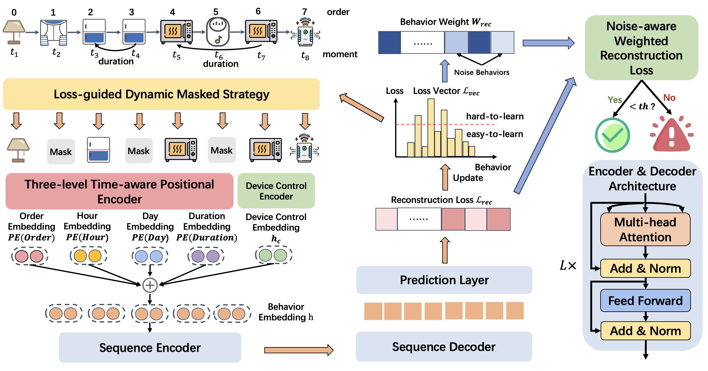

# Make Your Home Safe: Time-aware Unsupervised User Behavior Anomaly Detection in Smart Homes via Loss-guided Mask

## Introduction
Smart homes, powered by the Internet of Things, offer great convenience but also pose security concerns due to abnormal behaviors, such as improper operations of users and potential attacks from malicious attackers. Several behavior modeling methods have been proposed to identify abnormal behaviors and mitigate potential risks. However, their performance often falls short because they do not effectively learn less frequent behaviors, consider temporal context, or account for the impact of noise in human behaviors. In this paper, we propose SmartGuard, an autoencoder-based unsupervised user behavior anomaly detection framework. First, we design a Loss-guided Dynamic Mask Strategy (LDMS) to encourage the model to learn less frequent behaviors, which are often overlooked during learning. Second, we propose a Three-level Time-aware Position Embedding (TTPE) to incorporate temporal information into positional embedding to detect temporal context anomaly. Third, we propose a Noise-aware Weighted Reconstruction Loss (NWRL) that assigns different weights for routine behaviors and noise behaviors to mitigate the interference of noise behaviors during inference. Comprehensive experiments on three datasets with ten types of anomaly behaviors demonstrates that SmartGuard consistently outperforms state-of-the-art baselines and also offers highly interpretable results.




## Environment Setup

```bash
# python==3.8
pip install torch==2.2.0
pip install transformers==4.35.2
pip install scikit-learn
```


## Baseline

Run the following commands to start training and evaluation on baseline models
```bash
python train.py --dataset an --model IsolationForest --attack SD
```


### Training & Evaluation

Run the following commands to start training and evaluation of SmartGuard.

```bash
python train.py --dataset an --model SmartGuard --mask_strategy loss_guided --mask_ratio 0.2 --mask_step 4 --layer 2 --batch 1024 --embedding 256
```


## Acknowledgments

Thanks to the publicly released dataset of [SmartSense](https://github.com/snudatalab/SmartSense). 


## Citation

```bibtex
@inproceedings{xiao2024SmartGuard,
  title={Make Your Home Safe: Time-aware Unsupervised User Behavior Anomaly Detection in Smart Homes via Loss-guided Mask},
  author={Xiao, Jingyu and Xu, Zhiyao and Zou, Qingsong and Li, Qing and Zhao, Dan and Fang, Dong and Li, Ruoyu and Tang, Wenxin and Li, Kang and Zuo, Xudong and Hu, Penghui and Jiang, Yong and Weng, Zixuan and Lyv.R, Michael},
  booktitle={Proceedings of the 30th ACM SIGKDD Conference on Knowledge Discovery and Data Mining},
  pages={3551–3562},
  year={2024}
}
```
