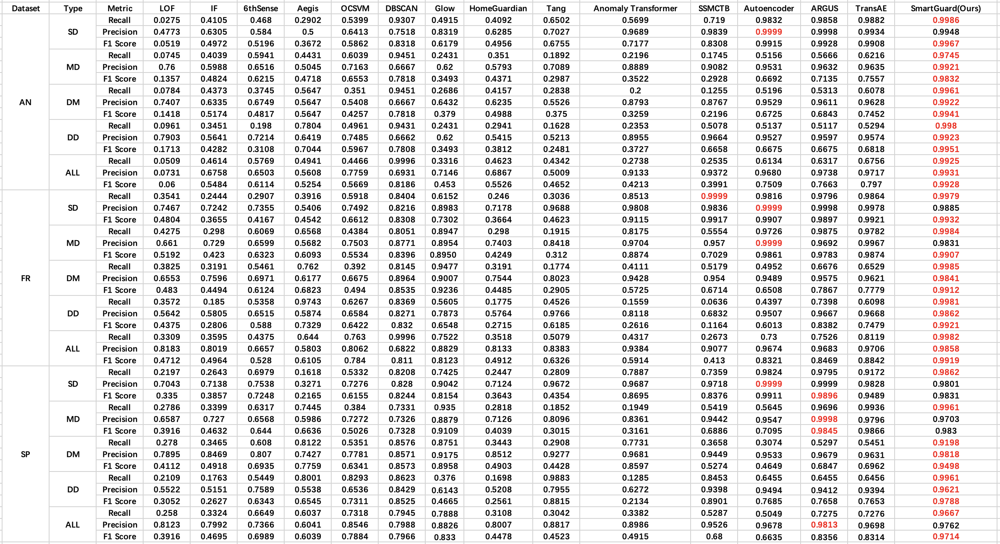

## Baseline

We make following changes about baseline table:

(1) We add precision results. (**Response to ReviewerTcaZ**)

(2) We add combined multi-class results while considering all kinds of anomalies. (**Response to Reviewerf23B and ReviewervEzK**)

(3) We add the following baselines (**Response to ReviewerDVsw**):
    
- SSMCTB [R1] Madan N, Ristea N C, Ionescu R T, et al. Self-supervised masked convolutional transformer block for anomaly detection[J]. IEEE Transactions on Pattern Analysis and Machine Intelligence,
- Anomaly Transformer [R2] Xu J, Wu H, Wang J, et al. Anomaly Transformer: Time Series Anomaly Detection with Association Discrepancy[C]//International Conference on Learning Representations. 2021

(4) We add non-mL anomaly detection methods as baselines (**Response to RevieweroMtJ**):
    
- desity-based models: DBSCAN
- normaizing flow: 

(5) We add some supervised learning models (**Response to ReviewerZGNc**):
    
- Homeguardian [R3] Dai, Xuan, et al. "Homeguardian: Detecting anomaly events in smart home systems." Wireless Communications and Mobile Computing 2022 (2022).
- Tang et al [R4] Tang, Sihai, et al. "Smart home IoT anomaly detection based on ensemble model learning from heterogeneous data." 2019 IEEE International Conference on Big Data (Big Data). IEEE, 2019.

(6) Latest baselines are added: HomeGuardian (R3, 2023), SSMCTB (R1, 2023) Anomaly-Transformer(R2, 2021), Tang (R4, 2019) (**Response to ReviewervEzK**)

**Conclusion: as shown in the above table, our model SmartGuard outperforms all other baselines in most cases.**

## Dataset
### Anomaly dataset construction method

For a certain type of anomaly, we randomly select some normal sequences containing the anomaly-related device, and then modify the device operation to the abnormal behavior. In addition, we will also randomly modify 1-2 normal behaviors in the sequence to simulate noise.

For SD type anomalies, taking Light flikering as an example, we first sample some sequences containing light operations from the normal data set, and then replace the light operations with the "on-off-on-off-on-off" behaviors sequence.

For DD type anomalies, taking ``Open the window while smartlock lock'' as an example, we first sample some sequences containing  "smartlock lock" from the normal dataset, then we will randomly select a behavior after "smartlock lock'' and replace it with "open window''.

For DM type anomalies, taking ``Open the watervalve at midnight'' as an example, we first sample some sequences occuring at midnight, then we will randomly select the position and randomly select a moment to insert the "open the water valve" in behavior sequences.

For DD type anomalies, taking ``Shower for long time'' as an example, we first sample some sequences containg shower behaviors, then we will change the time of the "turning off the shower" behavior to simulate that the user shower for long time.

**The anomaly sequences are highly aligning with real scenarios**. On the one hand, our modification is based on the user’s normal behavior sequence, which truly reflects the user’s daily behavior and habits. We also added noise behaviors to simulate real scenarios. On the other hand, to avoid abnormal behavior being discovered, attackers always insert attack behaviors between normal behaviors, and users' abnormal behaviors usually occur in daily normal behaviors, which is consistent with the way our data set is constructed.

The details of the abnormal samples are as follows:

### The number of samples of different types of anomaly.

There is no water valve device on the AN and FR datasets. There is no shower device on FR and SO datasets. Therefore the corresponding sample size is 0 because we cannot inject the corresponding anomalies.

| SD anomaly | Light flickering | Camera flickering | TV flickering |
|:----------:|:----------------:|:-----------------:|:-------------:|
|     AN     |        255       |        255        |      255      |
|     FR     |        641       |        641        |      641      |
|     SP     |       2186       |        2186       |      2186     |

| MD anomaly | Open the window while smartlock lock | Close the camera while smartlock lock |
|:----------:|:------------------------------------:|:-------------------------------------:|
|     AN     |                  255                 |                  255                  |
|     FR     |                  641                 |                  641                  |
|     SP     |                 2186                 |                  2186                 |

| DM anomaly | Open the airconditioner’s cool mode in   winter | Open the window at midnight | Open the watervalve at midnight |
|:----------:|:-----------------------------------------------:|:---------------------------:|:-------------------------------:|
|     AN     |                       255                       |             255             |                0                |
|     FR     |                       641                       |             641             |                0                |
|     SP     |                       2186                      |             2186            |               2186              |

| DD anomaly | Shower for long time | Microwave runs for long time |
|:----------:|:--------------------:|:----------------------------:|
|     AN     |          255         |              255             |
|     FR     |           0          |              841             |
|     SP     |           0          |             2586             |

### The period of different types of anomaly.

|    |               SD               |               MD               |               DM               |               DD               |
|:--:|:------------------------------:|:------------------------------:|:------------------------------:|:------------------------------:|
| AN |     [2022-07-31,2022-08-31]    |     [2022-07-31,2022-08-31]    |     [2022-07-31,2022-08-31]    |     [2022-07-31,2022-08-31]    |
| FR |     [2022-02-27,2022-03-25]    |     [2022-02-27,2022-03-25]    |     [2022-02-27,2022-03-25]    |     [2022-02-27,2022-03-25]    |
| SP |     [2022-02-28,2022-03-30]    |     [2022-02-28,2022-03-30]    |     [2022-02-28,2022-03-30]    |     [2022-02-28,2022-03-30]    |

