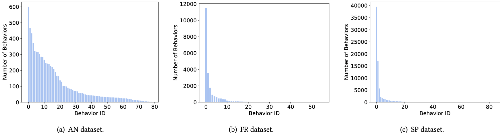
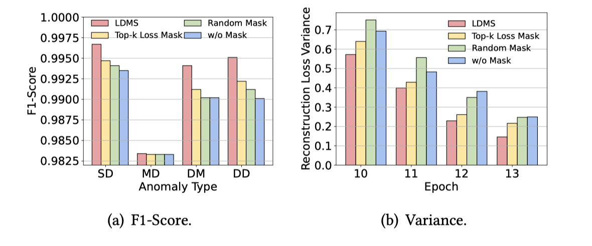
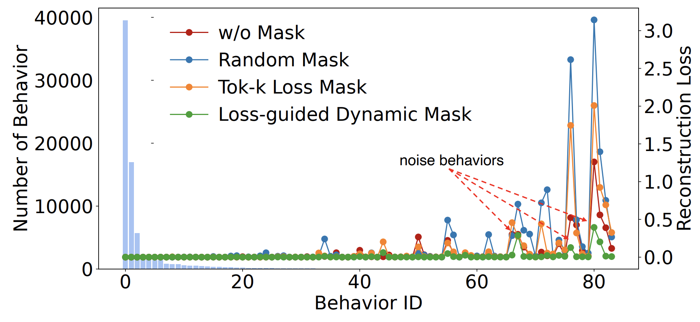

## Behavior Imbalance (A2)

### Figure1

As shown in the above figure, the three datasets show obvious behavioral imbalance.

### Figure2

As shown in the above figure, we compare the reconstruction losses distribution between SmartGuard and autoencoder-based approaches. As shown in the above figure, SmartGuard learns less frequent behaviors better than autoencoder-based approaches because SmartGuard's LDMS module can encourage the model to learn hard-to-learn behaviors. 

### Figure3

### Figure4

To verify the effectiveness of LDMS, we compared it with the three baselines (w/o mask, random mask and top-𝑘 loss mask) mentioned in the section 4.2. As illustrated in Figure 3(a), LDMS consistently outperforms all other mask strategies across four types of anomalies. The results presented in Figure 3(b) further demonstrate that LDMS exhibits the smallest variance in reconstruction loss throughout the training process, which demonstrates that SmartGuard learns both easy-to-learn behaviors and hard-to-learn behaviors very well. We also plotted the loss distribution diagram under different mask strategies. As shown in Figure 4, LDMS shows the smallest reconstruction loss and variance, which demonstrates that our mask strategy can better learn hard-to-learn behaviors. We can still observe behaviors with high reconstruction loss as pointed by the red dashed arrow after applying LDMS, which is likely to be noise behaviors, thus it’s necessary to assign small weights for these noise behaviors during anomaly detection for avoiding identifying normal sequences containing noise behaviors as abnormal.