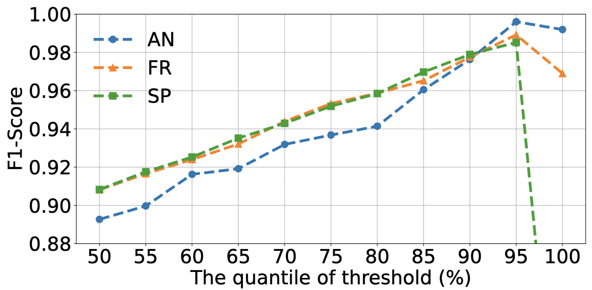

## Threshold (A2)

We tested the anomaly detection performance of SmartGuard under different $th$. As shown in the above figure, a smaller threshold may cause the model to misidentify normal samples as anomalies, while a larger threshold (>95%) may cause the model to miss anomalies. When the quantile of threshold is 95%, SmartGuard can achieve the best anomaly detection performance.

## Computational Complexity Analysis  (A3)
Embedding size is $d$, behavior sequence length is $n$, and the number of behavior types is $|C|$. SmartGuard consists of LDMS, TTPE, NWRL and Transformer architecture.  (1) LDMS: it maintains top-$k$ behaviors with higher loss and generates $n$ masks, the complexity is $O(|C|log(|C|)+n)$; (2) TTPE: the computational complexity of each time embedding is $O(nd)$,  the complexity is $O(3nd)$; (3) NWRL: NWRL generates weights for $|C|$ behaviors, the complexity is $O(|C|)$; (4) Transformer: the complexity mainly stems from the self-attention layer and the FNN, which is $O(n^2d + nd^2)$. The complexity of SmartGuard is $O(|C|log(|C|)+n+3nd+n^2d + nd^2+|C|)$.  **The dominant term is $O(n^2d)$ from the self-attention layer.** The complexity is polynomial and $n$, $d$ are not large, so SmartGuard has high scalability. IoT anomaly detection models are often deployed in the cloud. We deployed the SmartGuard on a cloud server with GeForce RTX 3090 Ti and tested the inference time. **SmartGuard only takes 0.0145s** to complete an inference, which shows it's high computational efficiency.