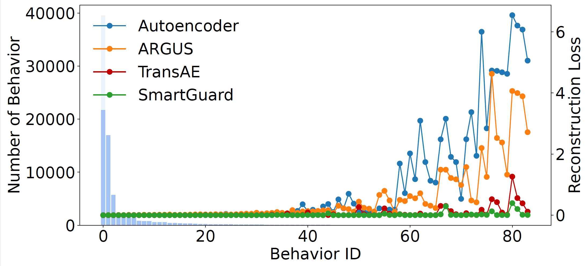

##Parameter (A2)

We tune the learning rate in {1, 0.1, 0.01, 0.001, 0.0001} and batch size in {128, 256, 512, 1024, 2048}. As shown in the above figure(a), when the learning rate increases from 0.0001 to 0.001, the performance of the model slightly improves. When learning rate is greater than 0.001, the training of the model is unstable, resulting in a sharp decline in performance. As shown in the above figure(b), as the batch size increases, F1-score increases. When the batch size exceeds 1024, the increase in batch size leads to a decrease in performance since larger batch size hurts the generalization ability of the model. When the learning rate is 0.001 and the batch size is 1024, the model can achieve optimal performance.

##Hyperparameters (A3)

For model hyperparameters of SmartGuard, we set the batch size to 1024 and the initial weights of TTPE are $w_{order}=0.1, w_{hour}=0.4, w_{day}=0.4$, and $w_{duration}=0.7$. For mask ratio and step without step, we searched in {0.2, 0.4, 0.6, 0.8} and {3, 4, 5, 6}, respectively. We chose the number of encoder and decoder layers in {1, 2, 3, 4}, and the embedding size in {8, 16, 32, 64, 128, 256, 512}. We also tuned batch size and learning rated as described in A2. Yes, we minimized validation set loss and choose hyperparameters based on the lowest loss.

We summarize the best hyperparameters in the following table.

##Deep Compare (A6)

We compare the learned attention weights compare between TransAE and SmartGuard. As shown in the above figure, we observe
that the attention weights between behaviors $b_6$, $b_7$, $b_8$, and other behaviors in the sequence are relatively smaller. This suggests that
$b_6$, $b_7$, $b_8$, and other behaviors lack contextual relevance and are
likely abnormal. However, the attention weights leaned by TransAE between behaviors $b_6$, $b_7$, $b_8$, and other behaviors are big. 

We also compare the reconstruction losses distribution between SmartGuard and autoencoder-based approaches. As shown in the above figure, SmartGuard learns less frequent behaviors better than autoencoder-based approaches because SmartGuard's LDMS module can encourage the model to learn \textit{hard-to-learn} behaviors. 