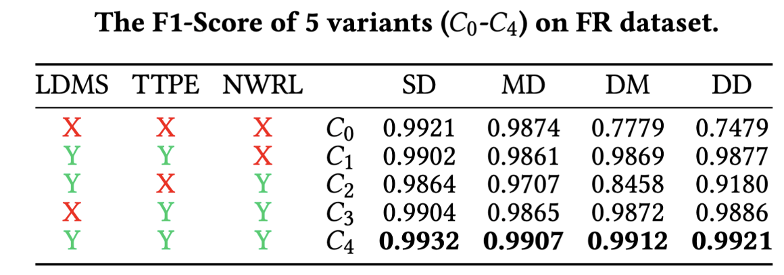
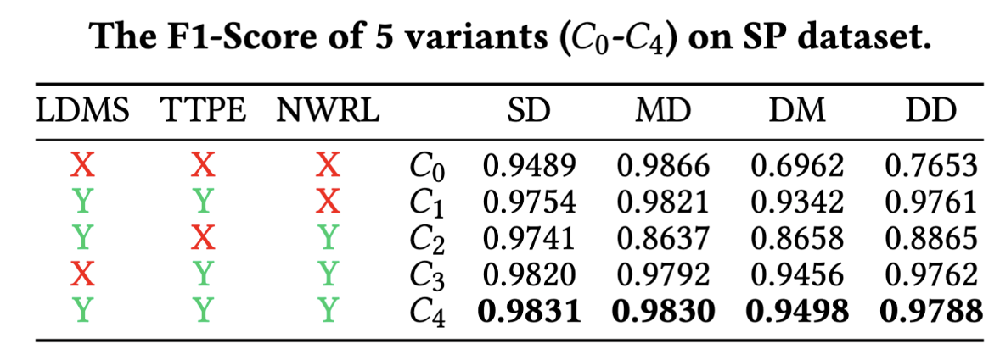
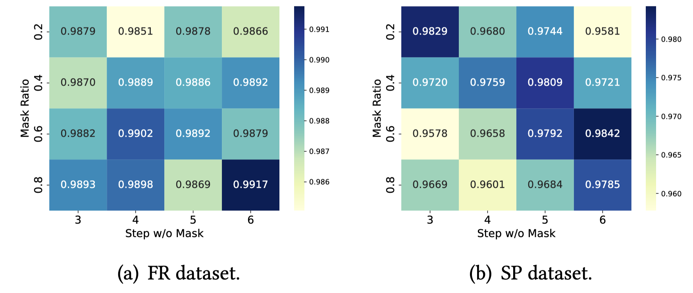

## Literature Survey (A2)

Yes, anomaly detection on user behaviors in smart homes is a classic and common requirement in the real world.
We want to clarify that in Section 2.1 "User Behavior Modeling in Smart Homes", the models are used to predict next behavior for IoT action recommendation, which is inconsistent with the goal of anomaly detection. 
Thus we say "However, above methods aim at predicting next behavior of user accurately, they can not be applied into abnormal behavior detection." These methods are introduced to let readers understand the techniques of user behavior modeling.
**We have introduced relevant methods to address anomaly detection problem in Section 2.2 in our paper ("Attacks and Defenses in Smart Homes", [R9]-[16])**

Detailed literature survey is as follows:

### User Behavior Modeling in Smart Homes

Some works propose to model user behavior (i.e., user device interaction) based on deep learning.
[R1] uses event transition graph to model IoT context and detect anomalies. In [R2], authors build device interaction graph to learn the device state transition relationship caused by user actions. [R3] detects anomalies through correlational analysis of device actions and physical environment. [R4] infers user behavior through readings from various sensors installed in the user's home.
IoTBeholder [R5] utilizes attention-based LSTM to predict the user behavior from history sequences. SmartSense [R6] leverages query-based transformer to model contextual information of user behavior sequences. DeepUDI [R7] and SmartUDI [R8] use relational gated graph neural networks, capsule neural networks and contrastive learning to model users' routines, intents and multi-level periodicities. However, above methods aim at predicting next behavior of user accurately, they can not be applied into abnormal behavior detection.

[R1] Gu, Tianbo, et al. "Iotgaze: Iot security enforcement via wireless context analysis." IEEE INFOCOM 2020-IEEE Conference on Computer Communications. IEEE, 2020.

[R2] Wang, Jincheng, et al. "Iot anomaly detection via device interaction graph." 2023 53rd Annual IEEE/IFIP International Conference on Dependable Systems and Networks (DSN). IEEE, 2023.

[R3] Fu, Chenglong, Qiang Zeng, and Xiaojiang Du. "{HAWatcher}:{Semantics-Aware} anomaly detection for appified smart homes." 30th USENIX Security Symposium (USENIX Security 21). 2021.

[R4] Srinivasan, Vijay, John Stankovic, and Kamin Whitehouse. "Protecting your daily in-home activity information from a wireless snooping attack." Proceedings of the 10th international conference on Ubiquitous computing. 2008.

[R5] Zou, Qingsong, et al. "Iotbeholder: A privacy snooping attack on user habitual behaviors from smart home wi-fi traffic." Proceedings of the ACM on Interactive, Mobile, Wearable and Ubiquitous Technologies 7.1 (2023): 1-26.

[R6] Jeon, Hyunsik, et al. "Accurate action recommendation for smart home via two-level encoders and commonsense knowledge." Proceedings of the 31st ACM International Conference on Information & Knowledge Management. 2022.

[R7] Xiao, Jingyu, et al. "User Device Interaction Prediction via Relational Gated Graph Attention Network and Intent-aware Encoder." Proceedings of the 2023 International Conference on Autonomous Agents and Multiagent Systems. 2023.

[R8] Xiao, Jingyu, et al. "I Know Your Intent: Graph-enhanced Intent-aware User Device Interaction Prediction via Contrastive Learning." Proceedings of the ACM on Interactive, Mobile, Wearable and Ubiquitous Technologies 7.3 (2023): 1-28.

### Attacks and Defenses in Smart Homes

An increasing number of attack vectors have been identified in smart homes in recent years. In addition to cyber attacks, it is also a concerning factor that IoT devices are often close association with the user's physical environment and they have the ability to alter physical environment. In this context, the automation introduces more serious security risks. Prior research has revealed that adversaries can leak personal information, and gain physical access to the home[R9], [R10]. In [R11], spoof attack is employed to exploit automation rules and trigger unexpected device actions. [R12] and [R13] apply delay-based attacks to disrupt cross-platform IoT information exchanges, resulting in unexpected interactions, rendering IoT devices and smart homes in an insecure state. This series of attacks aim at causing smart home devices to exhibit expected actions, thereby posing significant security threats. Therefore, designing an effective mechanism to detect such attacks is necessary. 6thSense [R14] utilizes Naive Bayes to detect malicious behavior associated with sensors in smart homes. Aegis [R15] utilizes a Markov Chain to detect malicious behaviors. ARGUS [R16] designed an Autoencoder based on Gated Recurrent Units (GRU) to detect infiltration attacks. However, these methods ignore the behavior imbalance, temporal information and noise behaviors.

[R9] Jia, Yunhan Jack, et al. "ContexloT: Towards providing contextual integrity to appified IoT platforms." ndss. Vol. 2. No. 2. 2017.

[R10] Celik, Z. Berkay, et al. "Sensitive information tracking in commodity {IoT}." 27th USENIX Security Symposium (USENIX Security 18). 2018.

[R11] Fernandes, Earlence, Jaeyeon Jung, and Atul Prakash. "Security analysis of emerging smart home applications." 2016 IEEE symposium on security and privacy (SP). IEEE, 2016.

[R12] Chi, Haotian, et al. "Delay wreaks havoc on your smart home: Delay-based automation interference attacks." 2022 IEEE Symposium on Security and Privacy (SP). IEEE, 2022.

[R13] Fu, Chenglong, et al. "Iot phantom-delay attacks: Demystifying and exploiting iot timeout behaviors." 2022 52nd Annual IEEE/IFIP International Conference on Dependable Systems and Networks (DSN). IEEE, 2022.

[R14] Sikder, Amit Kumar, Hidayet Aksu, and A. Selcuk Uluagac. "{6thSense}: A context-aware sensor-based attack detector for smart devices." 26th USENIX Security Symposium (USENIX Security 17). 2017.

[R15] Sikder, Amit Kumar, et al. "Aegis: A context-aware security framework for smart home systems." Proceedings of the 35th Annual Computer Security Applications Conference. 2019.

[R16] Rieger, Phillip, et al. "{ARGUS}:{Context-Based} Detection of Stealthy {IoT} Infiltration Attacks." 32nd USENIX Security Symposium (USENIX Security 23). 2023.

We also add some baselines after literature survey:

[R17] Madan N, Ristea N C, Ionescu R T, et al. Self-supervised
masked convolutional transformer block for anomaly detection[J].
IEEE Transactions on Pattern Analysis and Machine Intelligence,

[R18] Xu J, Wu H, Wang J, et al. Anomaly Transformer: Time Se-
ries Anomaly Detection with Association Discrepancy[C]//International
Conference on Learning Representations. 2021

[R19] Dai, Xuan, et al. "Homeguardian: Detecting anomaly events in smart home systems." Wireless Communications and Mobile Computing 2022 (2022).

[R20] Tang, Sihai, et al. "Smart home IoT anomaly detection based on ensemble model learning from heterogeneous data." 2019 IEEE International Conference on Big Data (Big Data). IEEE, 2019.

## Experiments (A3)

(1) Ablation study. As shown in the following tables, each
component of SmartGuard has a positive impact on results. The
combination of all components brings the best results on FR and SP dataset.

(2) Parameter experiments. As shown in Figure(a), when mask ratio is 0.8, step w/o mask is 6, SmartGuard achieves the best anomaly detection performance on FR dataset. As shown in Figure(b), on SP dataset, when mask ratio is 0.6, step w/o mask is 6, SmartGuard achieves the best performance.

